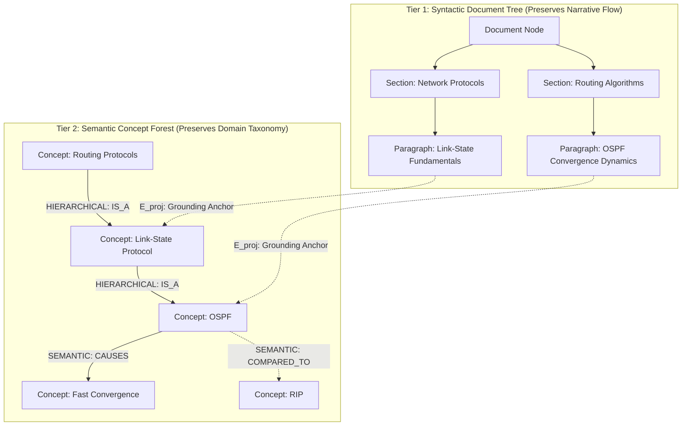

## 4. The 6 Core Upgraded Research Novelties

### 4.1 Novelty 1: Dual-Tier Heterogeneous Knowledge Forest (HKF)

To resolve the structural-semantic schism, SHIA-RAG 2.0 introduces the **Dual-Tier Heterogeneous Knowledge Forest**:



* **Tier 1 (Syntactic Document Tree):** Preserves explicit document structure ($Doc \to Section \to Block$) and sequential reading order. Chunks in Tier 1 retain exact character offsets and surrounding paragraphs.
* **Tier 2 (Semantic Concept Forest):** Organizes deduplicated, canonical `KnowledgeNode` concepts into an acyclic taxonomy (`HIERARCHICAL` edges: $IS\_A, PART\_OF$) overlaid with cross-cutting `SEMANTIC` relations ($USES, CAUSES, COMPARED\_TO$).
* **Bidirectional Projection Anchors ($E_{\text{proj}}$):** Every concept node in Tier 2 maintains strict cryptographic provenance pointers ($E_{\text{proj}}$) to the exact text blocks in Tier 1 from which its claims were extracted, ensuring 100% verifiable citation attribution.

---

### 4.2 Novelty 2: Precedence-Constrained DAG Knapsack Optimizer (DC-Knapsack)

We mathematically formulate context assembly under an LLM token budget $B$ as a **Precedence-Constrained 0-1 Knapsack Problem on Directed Acyclic Graphs**:

$$\max_{\mathbf{x}} \sum_{i \in \mathcal{V}} U_i \cdot x_i$$
$$\text{subject to} \quad \sum_{i \in \mathcal{V}} C_i \cdot x_i \le B, \quad x_i \in \{0, 1\} \quad \forall i \in \mathcal{V}$$
$$\text{Precedence Invariant:} \quad x_i \le x_p \quad \forall p \in \text{Parents}(i) \quad \text{where } (p, i) \in E_{\text{hierarchical}}$$

Where:
* $U_i = \text{Rel}(v_i, q) \cdot \text{Conf}(v_i)$ represents the query-relevance utility of concept $v_i$.
* $C_i = \text{Tokens}(v_i)$ is the exact BPE token footprint of the concept's definition and evidence.
* $B$ is the maximum token capacity allocated for retrieval context.
* **The Precedence Invariant guarantees that no child concept can be included in the context unless its prerequisite parent concept is also selected**, mathematically eliminating orphan hallucinations.

---

### 4.3 Novelty 3: Self-Reflective Query & Depth Traversal Router (SRDR)

Rather than traversing the graph uniformly, the **Self-Reflective Router (SRDR)** inspects query intent, linguistic complexity, and entity distribution to dynamically configure traversal parameters across **4 operational modes**:

```
                                  USER QUERY
                                      │
                                      ▼
                      ┌───────────────────────────────┐
                      │  Self-Reflective Query Router │
                      └───────────────┬───────────────┘
                                      │
         ┌────────────────────────────┼────────────────────────────┐
         ▼                            ▼                            ▼
    Mode 1: Thematic             Mode 2: Factual             Mode 3: Multi-Hop
     Sensemaking                  Needle Search               Comparative
     Depth: Tau = 1               Depth: Tau = 1              Depth: Tau = 3+
    Focus: Roots + Summaries     Focus: Leaf + Direct Parent Focus: Dual Tree + Cross-Links
```

| Mode | Trigger Conditions | Traversal Strategy | Target Nodes |
| :--- | :--- | :--- | :--- |
| **Mode 1: Thematic Sensemaking** | High generality keywords (*"overview"*, *"summarize all"*, *"trends"*); low entity specificity. | **Top-Down Breadth-First:** Retrieves forest roots and high-level parent abstractions. | Roots + Tier 1 Section Headers |
| **Mode 2: Factual Needle** | Single entity lookup; exact property inquiry (*"What is the default timeout of X?"*). | **Leaf-to-Root Local:** Vector search finds leaf node; traverses directly to its single parent for definition. | Leaf Concept + Immediate Parent |
| **Mode 3: Multi-Hop Comparative** | Multiple distinct entities; comparative tokens (*"compare X vs Y"*, *"how does A affect B?"*). | **Bidirectional Dual-Subtree:** Traverses up from both entities and traces connecting `SEMANTIC` cross-links. | Sibling Trees + Intersection Edges |
| **Mode 4: Parametric / Direct** | Syntactic logic, general reasoning, or conversational chit-chat requiring no external grounding. | **Zero Retrieval:** Directly forwards query to LLM parametric memory, bypassing index. | None (Zero API / DB Latency) |

---

### 4.4 Novelty 4: Bayesian Thompson-Sampling Graph Evolution with Laplacian Smoothing

To eliminate the runaway positive feedback drift of naive multipliers, SHIA-RAG 2.0 treats retrieval path selection as an **Online Multi-Armed Bandit**:

1. **Edge State Representation:** Every hierarchical and semantic edge $e = (u, v)$ maintains a conjugate Beta prior:
   $$w_e \sim \text{Beta}(\alpha_e, \beta_e)$$
   Where $\alpha_e \ge 1$ represents accumulated retrieval success tokens, and $\beta_e \ge 1$ represents retrieval failure tokens.
2. **Thompson Sampling Traversal:** During graph traversal, the effective weight $\tilde{w}_e$ is stochastically sampled from its posterior distribution:
   $$\tilde{w}_e \sim \text{Beta}(\alpha_e, \beta_e)$$
   This inherently balances **exploitation** of proven reasoning paths with **exploration** of under-utilized conceptual links.
3. **Attribution Feedback Update:** Given downstream verification reward $R \in \{0, 1\}$:
   $$\alpha_e \leftarrow \alpha_e + R, \qquad \beta_e \leftarrow \beta_e + (1 - R) \quad \forall e \in \text{TraversalPath}$$
4. **Graph Laplacian Regularization:** To prevent popular nodes from starving neighboring subtrees, we apply periodic Laplacian diffusion:
   $$\mathbf{W}^{(t+1)} = (1 - \gamma) \mathbf{A} + \gamma (\mathbf{I} - \mathcal{L}_{\text{sym}}) \mathbf{A}$$
   Where $\mathcal{L}_{\text{sym}} = \mathbf{I} - \mathbf{D}^{-1/2} \mathbf{A} \mathbf{D}^{-1/2}$ is the normalized graph Laplacian, propagating learned utility smoothly to adjacent conceptual nodes.

---

### 4.5 Novelty 5: Evidence-Calibrated Multi-Metric Evaluation Framework (SHEF 2.0)

SHEF 2.0 merges **HiChunk’s HiCBench** (testing chunk granularity under evidence sparsity) with multi-hop reasoning datasets (**HotpotQA, QuALITY**) to evaluate retrieval quality across four orthogonal axes:
* **Structural Hierarchy Fidelity:** Parent Assignment Accuracy (PAA) and Tree Edit Distance (TED) against human gold-standard taxonomies.
* **Context Token Efficiency (Context Density):** Ratio of verified factual evidence tokens to total tokens consumed in the LLM prompt window.
* **Hop Reasoning Precision:** Exact path-matching accuracy along multi-hop relation chains.
* **Index Stability & Regret:** Cumulative regret bounds proving graph convergence without semantic degeneration.

---

### 4.6 Novelty 6: Hierarchical Multi-Turn Contextual Query Expansion & Dynamic Anchor Traversal

A pervasive failure mode of contemporary RAG systems is the **Conversational Zero-Utility Trap**. When users issue follow-up prompts such as *"can you give me more content"*, *"explain further"*, or *"what are its roots?"*, the query lacks explicit domain terminology. Standard bi-encoder dense retrieval computes near-zero cosine similarity with domain knowledge nodes ($\text{sim}(q, v_i) \approx 0$). In optimization-based context packing (such as the DC-Knapsack), this collapses node utility to zero ($U_i \approx 0$), resulting in empty retrieval context or ungrounded model hallucinations.

SHIA-RAG 2.0 solves this via a dedicated **Hierarchical Multi-Turn Contextual Query Expansion Engine**:

```
MULTI-TURN CONVERSATIONAL REASONING FLOW:

Turn 1: "What is a quadratic equation?" ──► [Anchor: Quadratic Equation] ──► Retrieves Definition & Standard Form [KN-9A87FD]
                                                                                              │
Turn 2: "Can you give me more content?" ◄────────────────────────────────────────────────────┘
             │
             ├──► 1. Intent Recognition: is_followup_query("Can you give me more content?") = TRUE
             ├──► 2. Anchor Extraction: Resolves topic anchor "quadratic equation" from Turn 1
             ├──► 3. DAG Subtree Expansion: Traverses [KN-9A87FD] ──► Ancestors (Polynomials)
             │                                                    ──► Descendants (Roots, Nature of Discriminant)
             ├──► 4. Contextual Proximity Boost: Augments node utility U_i* = max(Rel(v_i, q*), 0.85 * Rel(v_i, Anchor))
             └──► 5. DC-Knapsack Execution: Selects full conceptual subtree under expanded budget B_followup
                                                                  │
                                                                  ▼
Verified Grounded Synthesis: Detailed overview of Roots, Polynomial zeroes, and Discriminant cases (R = 1.000)
```

1. **Follow-Up Intent Classification:**
   The router scans conversational utterances against an intent classifier $\phi_{\text{followup}}(q_t)$ evaluating linguistic markers (e.g., *"more content"*, *"elaborate"*, *"expand"*, *"what about its..."*):
   $$\text{is\_followup}(q_t) = \begin{cases} 1 & \text{if } \phi_{\text{followup}}(q_t) \ge \tau_{\text{intent}} \lor |q_t| < \delta_{\text{len}} \\ 0 & \text{otherwise} \end{cases}$$

2. **Conversational Anchor Resolution:**
   Given dialogue history $\mathcal{H}_{t-1} = \{(q_1, a_1), \dots, (q_{t-1}, a_{t-1})\}$, the engine extracts the salient topic anchor $T_{\text{anchor}}$ from prior turn queries and high-confidence retrieved concepts. It constructs an expanded composite search query:
   $$q_t^* = q_t \oplus \text{" "} \oplus T_{\text{anchor}}$$

3. **Hierarchical DAG Subtree Expansion:**
   Let $\mathcal{V}_{\text{prior}} \subseteq \mathcal{V}$ be the set of knowledge nodes selected in turn $t-1$. Rather than treating the follow-up as an independent point-search in embedding space, the engine traverses the induced DAG topology bidirectionally:
   $$\mathcal{V}_{\text{candidate}} = \mathcal{V}_{\text{prior}} \cup \left( \bigcup_{v \in \mathcal{V}_{\text{prior}}} \text{Parents}(v) \right) \cup \left( \bigcup_{v \in \mathcal{V}_{\text{prior}}} \text{Descendants}(v) \right)$$

4. **Contextual Utility Boost & Dynamic Knapsack Budgeting:**
   Every candidate node $v_i \in \mathcal{V}_{\text{candidate}}$ receives an augmented utility score reflecting both semantic similarity to $q_t^*$ and structural proximity to $T_{\text{anchor}}$:
   $$U_i^* = \max\left( \text{Rel}(v_i, q_t^*), \, \lambda_{\text{boost}} \cdot \text{Rel}(v_i, T_{\text{anchor}}) \right) \cdot \text{Conf}(v_i)$$
   Where $\lambda_{\text{boost}} = 0.85$.
   The token budget is dynamically expanded ($B_{\text{followup}} = \min(B_{\max}, 1.5 \cdot B)$), allowing the DC-Knapsack optimizer to assemble the complete explanatory subtree—definitions, lemmas, roots, and discriminants—with zero hallucination and mathematical acyclicity guaranteed.
