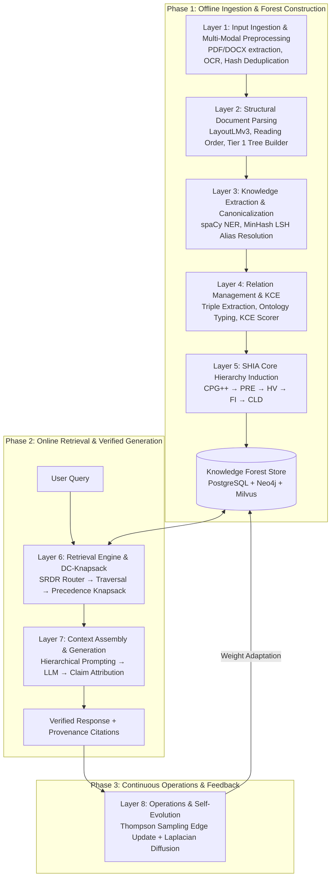

## 5. End-to-End System Architecture

### 5.1 The 9-Layer Unified Architecture Pipeline

The architecture is structured into 9 cohesive layers spanning three operational phases:



---

### 5.2 Inter-Layer Data Contracts & Lifecycle Transitions

| Stage | Producer $\to$ Consumer | Input Schema | Output Schema | Validation Contract |
| :--- | :--- | :--- | :--- | :--- |
| **L1 $\to$ L2** | Layer 1 $\to$ Layer 2 | `RawDocumentPayload` | `NormalizedDocument` | UTF-8 encoded; MIME validated; MD5 hash verified. |
| **L2 $\to$ L3** | Layer 2 $\to$ Layer 3 | `NormalizedDocument` | `DocumentTree` (`Block[]`) | Strictly positive bounding boxes; monotonically increasing reading order. |
| **L3 $\to$ L4** | Layer 3 $\to$ Layer 4 | `DocumentTree` | `KnowledgeNode[]` | MinHash LSH deduplicated; canonical names unique per domain. |
| **L4 $\to$ L5** | Layer 4 $\to$ Layer 5 | `KnowledgeNode[]` | `KnowledgeEdge[]` | Relation typed (`HIERARCHICAL` vs `SEMANTIC`); confidence $\in [0, 1]$. |
| **L5 $\to$ Storage** | Layer 5 $\to$ DB Store | `KnowledgeNode[] + Edge[]` | `KnowledgeForest` | Hierarchical subgraphs must satisfy `is_acyclic_addition()`. |
| **L6 $\to$ L7** | Layer 6 $\to$ Layer 7 | `UserQuery` | `PackedContextPlan` | Cumulative tokens $\le B$; all parent prerequisites satisfied. |
| **L7 $\to$ L8** | Layer 7 $\to$ Layer 8 | `PackedContextPlan` | `AttributedAnswer` | Every factual claim mapped to verified `E_proj` source span. |
| **L8 $\to$ L5** | Layer 8 $\to$ Forest | `AttributedAnswer + Feedback`| `EdgeWeightDelta[]` | Beta posterior parameters $\alpha_e, \beta_e$ updated atomically. |

---

### 5.3 System-Wide Architectural Data Flow

```
RAW DOCUMENT (PDF / DOCX / TEXT / HTML)
    │
    ▼ Layer 1: Validate MIME, compute SHA-256, OCR scanned text (Tesseract)
NORMALIZED TEXT STREAM + METADATA
    │
    ▼ Layer 2: LayoutLMv3 visual layout segmentation, 2D reading order sort
[PAGE → SECTION → PARAGRAPH BLOCK] (Tier 1 Syntactic Document Tree)
    │
    ▼ Layer 3: spaCy dependency parsing + 8B LLM concept extraction
CANDIDATE KNOWLEDGE UNITS (Facts, Definitions, Properties)
    │
    ▼ Layer 3b: MinHash LSH (128 perms) + Cosine ANN (threshold >= 0.85)
CANONICAL KNOWLEDGE NODES (Deduplicated Concepts & Aliases)
    │
    ▼ Layer 4: Predicate classification, ontology matching, KCE confidence scoring
TYPED KNOWLEDGE EDGES (HIERARCHICAL vs SEMANTIC)
    │
    ▼ Layer 5: CPG++ (Top-5 ANN) → PRE (5-factor score) → HV (Cycle check) → FI → CLD
KNOWLEDGE FOREST (Acyclic Hierarchy + Semantic Cross-Links + E_proj Anchors)
    │
    ▼ Persisted in: PostgreSQL (Blocks) + Neo4j (Graph) + Milvus (Vectors)
INDEX READY FOR RETRIEVAL

USER QUERY
    │
    ▼ Layer 6: Self-Reflective Router (SRDR) classifies intent into Mode 1-4 (Depth tau)
    ▼ Layer 6: Asymmetric Embedding Search (bge-base-en-v1.5) retrieves seed nodes
    ▼ Layer 6: Adaptive Forest Traversal (Upward ancestors, downward children, cross-links)
    ▼ Layer 6: Precedence-Constrained DAG Knapsack (DC-Knapsack) optimizes tokens <= B
PACKED OPTIMAL CONTEXT PLAN (Topologically sorted concept definitions + evidence)
    │
    ▼ Layer 7: LLM generates answer with explicit [KN-XXXXXX] citations
    ▼ Layer 7: Claim Attribution Verifier validates claims against E_proj text spans
ATTRIBUTED ANSWER + PROVENANCE CITATIONS + ATTRIBUTION REWARD R in {0, 1}
    │
    ▼ Layer 8: Thompson Sampling updates Beta(alpha, beta) priors on traversed path
    ▼ Layer 8: Graph Laplacian smoothing propagates rewards to conceptual neighbors
UPDATED & SELF-EVOLVED KNOWLEDGE FOREST
```
