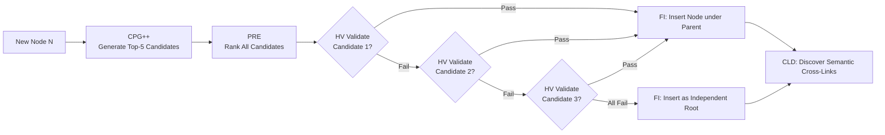

## 6. Detailed Layer-by-Layer Module Design, Schemas & Algorithms

### 6.1 Layer 0: Foundational Data Model & Canonical Schemas

#### Schema 1: `KnowledgeNode` (Canonical Concept Representation)

```json
{
  "$schema": "https://json-schema.org/draft/2020-12/schema",
  "title": "KnowledgeNode",
  "type": "object",
  "required": ["node_id", "canonical_name", "domain", "confidence", "abstraction_level", "token_cost"],
  "properties": {
    "node_id": { "type": "string", "pattern": "^KN-[A-Z0-9]{8}$" },
    "canonical_name": { "type": "string", "minLength": 2 },
    "aliases": { "type": "array", "items": { "type": "string" } },
    "definition": { "type": "string", "minLength": 10 },
    "domain": { "type": "string" },
    "abstraction_level": { "type": "number", "minimum": 0.0, "maximum": 1.0 },
    "confidence": { "type": "number", "minimum": 0.0, "maximum": 1.0 },
    "token_cost": { "type": "integer", "minimum": 1 },
    "embedding": { "type": "array", "items": { "type": "number" } },
    "tier1_anchors": {
      "type": "array",
      "items": {
        "type": "object",
        "properties": {
          "doc_id": { "type": "string" },
          "block_id": { "type": "string" },
          "char_start": { "type": "integer" },
          "char_end": { "type": "integer" }
        }
      }
    }
  }
}
```

#### Schema 2: `KnowledgeEdge` (Dual-Class Relationship Representation)

```json
{
  "$schema": "https://json-schema.org/draft/2020-12/schema",
  "title": "KnowledgeEdge",
  "type": "object",
  "required": ["edge_id", "source_id", "target_id", "edge_class", "relation_type", "alpha", "beta"],
  "properties": {
    "edge_id": { "type": "string", "pattern": "^KE-[A-Z0-9]{8}$" },
    "source_id": { "type": "string" },
    "target_id": { "type": "string" },
    "edge_class": { "type": "string", "enum": ["HIERARCHICAL", "SEMANTIC"] },
    "relation_type": { "type": "string", "enum": ["IS_A", "PART_OF", "USES", "CAUSES", "COMPARED_TO"] },
    "confidence": { "type": "number", "minimum": 0.0, "maximum": 1.0 },
    "alpha": { "type": "number", "minimum": 1.0, "description": "Thompson Beta Success Prior" },
    "beta": { "type": "number", "minimum": 1.0, "description": "Thompson Beta Failure Prior" }
  }
}
```

---

### 6.2 Layer 1 & Layer 2: Ingestion, Layout & Tier 1 Document Tree Parsing

1. **Document Normalization:** Supports PDF, DOCX, Markdown, and HTML. PDFs undergo native vector stream extraction; scanned pages route to Tesseract OCR with binarization and skew correction.
2. **Layout Detection:** Employs LayoutLMv3 to segment pages into typed regions (`HEADING`, `PARAGRAPH`, `TABLE`, `CODE`, `LIST`).
3. **Reading Order Recovery:** Computes a topological sort over bounding boxes using spatial coordinates ($Y$-band thresholding with multi-column $X$-boundary segmentation).
4. **Tier 1 Syntactic Document Tree Construction:** Emits a rooted tree:
   $$\mathcal{T}_{\text{doc}} = (V_{\text{doc}}, E_{\text{syntax}})$$
   Where each heading owns its nested paragraph blocks, retaining the original discursive context.

---

### 6.3 Layer 3 & Layer 4: Knowledge Extraction, Canonicalization & KCE

1. **Hybrid Entity & Relation Extraction:**
   * **Stage 1 (Fast Symbolic Filtering):** Uses spaCy dependency parsing to locate copular verbs (`"is a"`, `"belongs to"`) and noun phrase chunks.
   * **Stage 2 (LLM Contextual Refinement):** Small fine-tuned 8B LLM structures extracted units into `(Subject, Relation, Object, Evidence)` tuples.
2. **MinHash LSH Alias Canonicalization:**
   * Textual signatures of concepts are hashed into 128 MinHash permutations.
   * Near-duplicate concepts with Jaccard similarity $\ge 0.85$ are merged into a canonical `KnowledgeNode`, consolidating aliases (e.g., `["Round Robin", "RR", "Round-Robin Scheduling"]`).
3. **Knowledge Confidence Engine (KCE):**
   Assigns a baseline confidence score $\text{Conf}(N)$ based on linguistic certainty, frequency across documents, and extraction model probability:
   $$\text{Conf}(N) = \sigma\left(\omega_1 \cdot \log(1 + \text{Freq}(N)) + \omega_2 \cdot P_{\text{model}} + \omega_3 \cdot S_{\text{lexical}}\right)$$

---

### 6.4 Layer 5: SHIA Core Hierarchy Induction Pipeline

Layer 5 integrates new concept nodes into the Knowledge Forest through five coordinated modules:



1. **CPG++ (Candidate Parent Generator):**
   * *Domain Filtering:* Limits candidates to the identical semantic domain.
   * *ANN Vector Retrieval:* Gathers the top-20 nearest conceptual neighbors using cosine similarity over concept embeddings.
   * *Abstraction Filter:* Prunes candidates whose abstraction level is lower than the candidate node.
   * Returns $\le 5$ candidate parents.
2. **PRE (Parent Ranking Engine):**
   Computes the unified parent fitness score $\text{Score}(P, N)$ (Section 7.2) across all candidates and outputs a strictly sorted list.
3. **HV (Hierarchy Validator):**
   Executes `is_acyclic_addition(P, N)` and validates that $\text{depth}(P) + 1 < D_{\max}$.
4. **FI (Forest Integrator):**
   Attaches directed hierarchical edge $P \to N$. If all candidates fail validation, $N$ is instantiated as a new independent forest root.
5. **CLD (Cross-Link Discovery):**
   Evaluates non-hierarchical semantic similarities between $N$ and adjacent subtrees. If cosine similarity exceeds threshold $\tau_{\text{cross}}$ and relation extraction predicts a valid predicate (`USES`, `CAUSES`), a `SEMANTIC` edge is added.

---

### 6.5 Layer 6, 7 & 8: Retrieval, Generation & Online Evolution

1. **SRDR Query Routing (Layer 6):** Classifies incoming queries into Modes 1–4, configuring traversal depth $\tau \in \{1, 2, 3, 4\}$.
2. **DC-Knapsack Context Packing (Layer 6):** Executes the Branch-and-Bound DAG Knapsack algorithm to assemble an optimal, precedence-constrained context under budget $B$.
3. **Attributed Generation (Layer 7):** Assembles prompts with explicit bracketed concept references `[KN-000456]`. The LLM generates the answer, followed by an automated verification step ensuring every claim matches the grounded evidence in the referenced node.
4. **Thompson Evolution Engine (Layer 8):** Collects verification reward $R \in \{0, 1\}$, updates Beta parameters $\alpha_e, \beta_e$ on all traversed edges, and triggers periodic Laplacian smoothing.
