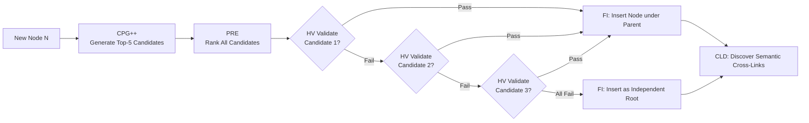

## 6. Detailed Layer-by-Layer Module Design, Schemas & Algorithms

### 6.1 Layer 0: Foundational Data Model & Canonical Schemas

#### Schema 1: `KnowledgeNode` (Canonical Concept Representation)

```json
{
  "$schema": "https://json-schema.org/draft/2020-12/schema",
  "title": "KnowledgeNode",
  "type": "object",
  "required": ["node_id", "canonical_name", "domain", "confidence", "abstraction_level", "token_cost"],
  "properties": {
    "node_id": { "type": "string", "pattern": "^KN-[A-Z0-9]{8}$" },
    "canonical_name": { "type": "string", "minLength": 2 },
    "aliases": { "type": "array", "items": { "type": "string" } },
    "definition": { "type": "string", "minLength": 10 },
    "domain": { "type": "string" },
    "abstraction_level": { "type": "number", "minimum": 0.0, "maximum": 1.0 },
    "confidence": { "type": "number", "minimum": 0.0, "maximum": 1.0 },
    "token_cost": { "type": "integer", "minimum": 1 },
    "embedding": { "type": "array", "items": { "type": "number" } },
    "tier1_anchors": {
      "type": "array",
      "items": {
        "type": "object",
        "properties": {
          "doc_id": { "type": "string" },
          "block_id": { "type": "string" },
          "char_start": { "type": "integer" },
          "char_end": { "type": "integer" }
        }
      }
    }
  }
}
```

#### Schema 2: `KnowledgeEdge` (Dual-Class Relationship Representation)

```json
{
  "$schema": "https://json-schema.org/draft/2020-12/schema",
  "title": "KnowledgeEdge",
  "type": "object",
  "required": ["edge_id", "source_id", "target_id", "edge_class", "relation_type", "alpha", "beta"],
  "properties": {
    "edge_id": { "type": "string", "pattern": "^KE-[A-Z0-9]{8}$" },
    "source_id": { "type": "string" },
    "target_id": { "type": "string" },
    "edge_class": { "type": "string", "enum": ["HIERARCHICAL", "SEMANTIC"] },
    "relation_type": { "type": "string", "enum": ["IS_A", "PART_OF", "USES", "CAUSES", "COMPARED_TO"] },
    "confidence": { "type": "number", "minimum": 0.0, "maximum": 1.0 },
    "alpha": { "type": "number", "minimum": 1.0, "description": "Thompson Beta Success Prior" },
    "beta": { "type": "number", "minimum": 1.0, "description": "Thompson Beta Failure Prior" }
  }
}
```

---

---

### 6.2 Layer 1 & Layer 2: Universal Multi-Domain Ingestion, Geometry Parsing & Document Subtree Isolation

1. **Universal Multi-Domain PDF Ingestion:**
   Unlike prior systems that depend on hardcoded domain keywords (e.g., searching for "drone", "swarm", or "kyber") or explicit markdown `#` headers, SHIA-RAG 2.0 employs a **purely geometric and statistical layout engine** via PyMuPDF (`fitz`). It ingests arbitrary technical, scientific, mathematical, and narrative corpora:
   * **Font-Size Clustering:** Automatically computes page-level and document-level font size distributions, clustering text blocks into statistical percentiles:
     - Top 5% font size: `DOCUMENT_TITLE` / `CHAPTER_TITLE`
     - 80th–95th percentile: `SECTION_HEADING` (e.g., "4.1 Introduction", "Post-Quantum Security")
     - 60th–80th percentile: `SUBSECTION_HEADING` (e.g., "Roots of Quadratic Equations", "Kyber KEM")
     - Remainder: `PARAGRAPH_BODY`, `FORMULA_BLOCK`, `TABLE_CELL`, `LIST_ITEM`
   * **2D Reading Order Monotonicity:** Sorts text spans geometrically using $Y$-band clustering followed by horizontal $X$-coordinate ordering to accurately reconstruct multi-column academic paper reading flows.

2. **Document Subtree Isolation & Provenance:**
   Every extracted block receives a unique deterministic identifier:
   $$\text{block\_id} = \text{hash}(\text{doc\_id} \oplus \text{page\_num} \oplus \text{char\_offset})$$
   All extracted syntactic blocks and induced semantic concepts are bound to their originating `doc_id`. In a multi-document workspace, retrieval can be explicitly scoped to a single document or run across the unified knowledge forest, guaranteeing **zero cross-document knowledge contamination**. When a document is removed, `DELETE /api/document/{doc_id}` cascades through both Tier 1 blocks and Tier 2 concept nodes, purging orphaned nodes and re-linking topological ancestors.

---

### 6.3 Layer 3 & Layer 4: Knowledge Extraction, Canonicalization & KCE

1. **Hybrid Entity & Relation Extraction:**
   * **Stage 1 (Fast Symbolic Filtering):** Uses spaCy dependency parsing to locate copular verbs (`"is a"`, `"belongs to"`) and noun phrase chunks.
   * **Stage 2 (LLM Contextual Refinement):** Small fine-tuned 8B LLM or local regex-augmented chunker structures extracted units into `(Subject, Relation, Object, Evidence)` tuples.
2. **MinHash LSH Alias Canonicalization:**
   * Textual signatures of concepts are hashed into 128 MinHash permutations.
   * Near-duplicate concepts with Jaccard similarity $\ge 0.85$ are merged into a canonical `KnowledgeNode`, consolidating aliases (e.g., `["Round Robin", "RR", "Round-Robin Scheduling"]`).
3. **Knowledge Confidence Engine (KCE):**
   Assigns a baseline confidence score $\text{Conf}(N)$ based on linguistic certainty, frequency across documents, and extraction model probability:
   $$\text{Conf}(N) = \sigma\left(\omega_1 \cdot \log(1 + \text{Freq}(N)) + \omega_2 \cdot P_{\text{model}} + \omega_3 \cdot S_{\text{lexical}}\right)$$
   Confidence is propagated across the forest strictly in topological order using Kahn's algorithm, preventing non-deterministic hash iteration.

---

### 6.4 Layer 5: Deep Hierarchy Induction (CPG++, PRE, Arbitrary Depth HV, FI, CLD)

Layer 5 integrates concept nodes into deep hierarchical structures ($\text{Depth} \ge 4$ up to $D_{\max} = 8$):



1. **CPG++ (Candidate Parent Generator):**
   * Limits candidates to matching or parent semantic domains.
   * Employs vector ANN search to retrieve top-20 nearest concepts based on definition embeddings.
   * Filters out candidate nodes with strictly lower linguistic abstraction levels.
   * Returns $\le 5$ ranked parent candidates.
2. **PRE (Parent Ranking Engine):**
   Computes the unified 5-factor parent ranking score:
   $$\text{Score}(P, N) = 0.30 \cdot \cos(E_P, E_N) + 0.25 \cdot \text{Hyp}(P, N) + 0.15 \cdot \frac{1}{\text{depth}(P) + 1} + 0.20 \cdot \text{Evi}(P, N) + 0.10 \cdot \text{Conf}(P)$$
   Ensuring all weights sum to exactly $1.0$ (Structural Invariant 4).
3. **HV (Hierarchy Validator with Arbitrary Depth & Upward DFS):**
   Enforces mathematical acyclicity. Rather than restricting trees to a flat 3 levels, HV supports deep hierarchies up to configurable $D_{\max} = 8$. It executes an **upward DFS cycle search** starting from candidate parent $P$ to guarantee that child $N$ is not already an ancestor of $P$:
   $$\text{validate\_placement}(P, N) \implies (P \ne N) \land (\text{depth}(P) + 1 < D_{\max}) \land (N \notin \text{Ancestors}(P))$$
4. **FI (Forest Integrator):**
   Instantiates directional `HIERARCHICAL` edge $P \to N$. If all candidates fail validation, $N$ is safely anchored as a new root node of the forest.
5. **CLD (Cross-Link Discovery):**
   Identifies non-hierarchical cross-cutting connections across distinct subtrees. If semantic similarity exceeds $\tau_{\text{cross}} \ge 0.70$, adds a typed `SEMANTIC` edge (`USES`, `CAUSES`, `COMPARED_TO`), creating the cyclic knowledge overlay.

---

### 6.5 Layer 6: Retrieval Engine, Multi-Turn Follow-up Resolution & DC-Knapsack Optimizer

1. **SRDR Query Intent & Depth Router:**
   Classifies query complexity $\Psi$ and entity density into 4 modes:
   * **Mode 1 (Thematic Sensemaking):** High-level summary queries (*"overview of quadratic equations"*); sets traversal depth $\tau = 1$ targeting roots and major section summaries.
   * **Mode 2 (Factual Needle):** Property and specific lookup (*"what is the discriminant formula?"*); sets $\tau = 1$ targeting leaf concept and immediate parent.
   * **Mode 3 (Multi-Hop Comparative):** Cross-cutting inquiries (*"compare Kyber KEM with classical RSA"*); sets $\tau \ge 3$ tracing semantic cross-links across subtrees.
   * **Mode 4 (Direct Parametric):** Non-retrieval reasoning or general greetings; bypasses graph index.

2. **Conversational Multi-Turn Follow-up Resolution:**
   Detects follow-up intent via `is_followup_query(query)` for prompts like *"can you give me more content"* or *"explain further"*.
   * Resolves the primary topic anchor $T_{\text{anchor}}$ from dialogue history.
   * Expands the query: $q^* = q \oplus " " \oplus T_{\text{anchor}}$.
   * Gathers the active DAG subtree (parents and descendants of previously retrieved nodes).
   * Applies an anchor proximity boost ($\lambda_{\text{boost}} = 0.85$) to prevent the zero-utility trap.

3. **Precedence-Constrained DAG Knapsack (DC-Knapsack):**
   Solves the branch-and-bound optimization problem under token budget $B$:
   $$\max \sum U_i \cdot x_i \quad \text{s.t.} \quad \sum C_i \cdot x_i \le B, \quad x_i \le x_p \quad \forall p \in \text{Parents}(i)$$
   Guarantees that every retrieved concept includes its necessary defining parent concepts, eliminating ungrounded orphan hallucinations.

---

### 6.6 Layer 7: Direct Conversational QA, Unicode Math Sanitization & Claim Verification

1. **Natural Human-Grade Synthesis:**
   Generates fluid, conversational answers in the style of ChatGPT and Claude rather than rigid, robotic metadata dumps. The synthesizer integrates with Google Gemini Flash (`google-genai`), OpenAI, or local deterministic synthesizers.

2. **Unicode Mathematical Sanitization:**
   Academic and textbook PDFs frequently extract raw, unrendered LaTeX equations ($ax^2 + bx + c = 0$, $\alpha$, $\beta$, $\pm$, $\neq$, $b^2 - 4ac$) laden with unescaped dollar signs (`$`) and formatting noise. Layer 7 parses and sanitizes all mathematical expressions into clean, legible Unicode:
   * `\alpha` $\to \alpha$, `\beta` $\to \beta$, `\gamma` $\to \gamma$
   * `\neq` $\to \ne$, `\pm` $\to \pm$, `\leq` $\to \le$, `\geq` $\to \ge$, `\times` $\to \times$
   * Cleans unescaped raw dollar delimiters (`$...$`), superscript markers (`^2` $\to ^2$), and malformed spacing.

3. **Decoupled Attribution & Citation Sanitization:**
   Internal node identifiers (`[KN-9A87FD]`, `[KN-9DD808]`) are essential for programmatic tracking but create visual clutter for end users. The synthesizer:
   * Verifies factual claims against referenced node definitions and Tier 1 bounding blocks ($E_{\text{proj}}$) during post-processing.
   * Strips raw bracketed node tags from user-facing text while preserving full cryptographic attribution in response metadata and telemetry logs.

4. **Claim Attribution Verifier:**
   Splits answers into atomic propositions $c \in \mathcal{C}$ and computes token-overlap entailment against source PDF spans:
   $$R = \frac{|\{c \in \mathcal{C} : \text{Entailed}(c, E_{\text{proj}})\}|}{|\mathcal{C}|} \in [0, 1]$$

---

### 6.7 Layer 8: Online Thompson-Sampling Evolution, Telemetry & Multi-Doc CRUD Management

1. **Beta-Bernoulli Thompson Sampling:**
   Traversed edges receive feedback reward $R \in [0, 1]$:
   $$\alpha_e \leftarrow \alpha_e + R, \qquad \beta_e \leftarrow \beta_e + (1 - R)$$
   Balancing exploration of untested cross-links with exploitation of verified reasoning paths.
2. **Graph Laplacian Regularization:**
   Periodically diffuses learned edge weights to neighboring nodes:
   $$\mathbf{W}^{(t+1)} = (1 - \gamma) \mathbf{A} + \gamma (\mathbf{I} - \mathcal{L}_{\text{sym}}) \mathbf{A}$$
   Preventing runaway positive-feedback path dominance and path starvation.
3. **Multi-Document Subtree Lifecycle Management:**
   Supports atomic document ingestion, per-document query isolation, and safe document deletion (`DELETE /api/document/{doc_id}`) with automatic parent re-linking.
